# 🩺 MediLex AI Assistant

**A Next-Gen Clinical Decision Support System Powered by RAG & Cohere Command R**

[](https://medilexai.streamlit.app/)
[](https://github.com/Hanzlase/MediLex-AI-.git)


---

## 📖 Overview

**MediLex AI** is an advanced **Retrieval-Augmented Generation (RAG)** system designed to assist medical professionals and students. It ingests raw medical transcriptions, indexes them for semantic search, and uses the **Cohere Command R** Large Language Model to answer complex clinical queries with precise source citations.

Unlike standard chatbots, MediLex is **grounded**—if the answer isn't in the medical records, it tells you, reducing hallucinations and ensuring reliability.

---

## 🏗️ System Architecture

```mermaid
graph LR
    A[📂 Medical Transcriptions CSV] -->|Cleaning & Chunking| B(Pre-processing)
    B -->|HuggingFace Embeddings| C[(FAISS Vector Store)]
    
    U[👤 User Query] -->|Streamlit UI| D{RAG Pipeline}
    D -->|Retrieve Top-k| C
    D -->|Context + Prompt| E[🧠 Cohere Command R]
    E -->|Grounded Answer| U
```



---

## ✨ Key Features

- 🏥 **Specialized Knowledge**: Trained on real-world medical transcriptions (Surgery, Radiology, SOAP notes)
- 📚 **Citation-Aware**: Every answer includes the Source ID and Specialty of the retrieved document
- 🛡️ **Hallucination Guard**: Explicitly refuses to answer if the information is missing from the context
- 🏎️ **High Performance**: Uses local HuggingFace Embeddings (all-MiniLM-L6-v2) for fast retrieval and Cohere Command R for accurate reasoning
- 🌑 **Professional UI**: Dark-themed, distraction-free Streamlit interface optimized for clinical environments

---

## 📂 Project Structure

```
MediLex-AI-/
├── 📂 Dataset/
│   └── mtsamples.csv          # Raw medical transcriptions
├── 📂 faiss_medical_index/    # Vector Database (Generated)
│   ├── index.faiss
│   └── index.pkl
├── 📜 .env                    # API Keys (Not uploaded to GitHub)
├── 📜 .gitignore              # Files to ignore
├── 📜 CareComply.py           # Ingestion Pipeline (ETL)
├── 📜 rag_backend.py          # RAG Logic & LLM Chain
├── 📜 app.py                  # Streamlit Frontend
├── 📜 requirements.txt        # Dependencies
├── 📜 test.md                 # Evaluation Questions
└── 📜 README.md               # Documentation
```

---

## 🚀 Local Setup Guide

### 1. Clone the Repository

```bash
git clone https://github.com/Hanzlase/MediLex-AI-.git
cd MediLex-AI-
```

### 2. Install Dependencies

```bash
pip install -r requirements.txt
```

### 3. Set Up Environment Keys

Create a `.env` file in the root directory:

```env
cohere_api_key=YOUR_COHERE_API_KEY_HERE
```

### 4. Build the Vector Database

Run the ingestion script once to process the dataset:

```bash
python CareComply.py
```

> This processes `mtsamples.csv`, chunks the text, and saves the FAISS index locally.

### 5. Launch the App

```bash
streamlit run app.py
```

---

## 📊 Evaluation

The system was evaluated on **30 Test Cases** across **5 medical specialties**.

| Specialty | Query Example | Status |
|-----------|---------------|--------|
| Allergy | "Symptoms of allergic rhinitis?" | ✅ Pass |
| Cardiology | "Procedure for cardiac catheterization?" | ✅ Pass |
| Neurology | "Diagnosis of carpal tunnel?" | ✅ Pass |
| Gastroenterology | "Indications for colonoscopy?" | ✅ Pass |
| Urology | "Treatment for kidney stones?" | ✅ Pass |

---

## 🛠️ Tech Stack

- **Frontend**: Streamlit
- **Vector Database**: FAISS
- **Embeddings**: HuggingFace (all-MiniLM-L6-v2)
- **LLM**: Cohere Command R
- **Framework**: LangChain
- **Language**: Python 3.10+

---

## 🤝 Contributing

Contributions are welcome! Please feel free to submit a Pull Request.

1. Fork the repository
2. Create your feature branch (`git checkout -b feature/AmazingFeature`)
3. Commit your changes (`git commit -m 'Add some AmazingFeature'`)
4. Push to the branch (`git push origin feature/AmazingFeature`)
5. Open a Pull Request

---

## 📝 License

This project is licensed under the MIT License - see the [LICENSE](LICENSE) file for details.

---

## 👨‍💻 Author

**Hanzlase**
- GitHub: [@Hanzlase](https://github.com/Hanzlase)
- Project: [MediLex AI](https://github.com/Hanzlase/MediLex-AI-)

---

<div align="center">
<sub>Developed for Generative AI Project 04 | Fall 2025</sub>
</div>
